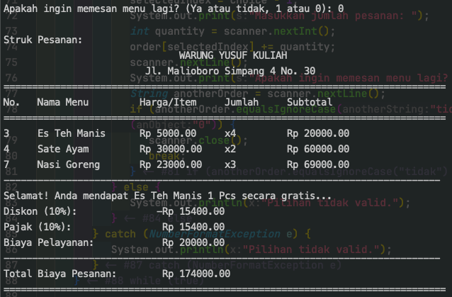

# msim4301.14-tugas-1
Tugas Tuton 1 membuat program Java studi kasus Restoran

Cuplikan gambar

Passed Test
- [x] Setiap item menu harus memiliki nama, harga, dan kategori (makanan, minuman).
- [x] Total Biaya keseluruhan pesanan ditambahkan dengan biaya pajak 10% dari total biaya keseluruhan dan biaya pelayanan sebesar Rp. 20.000,-
- [x] Diskon 10% jika total biaya keseluruhan pesanan melebihi Rp 100.000,-
- [x] Penawaran beli satu gratis satu untuk salah satu kategori minuman jika total biaya keseluruhan pesanan melebihi Rp 50.000 (Akan diacak otomatis jika di struk pelanggan memesan 2 jenis minuman)
- [x] mencetak struk pesanan yang mencantumkan item-menu yang dipesan, jumlahnya, harga per item, total harga per item, total biaya pemesanan dan biaya pajak, dan biaya pelayanan.

Cara Run kode ini :
Buka terminal / CMD
Ketik / Copy : `./run.sh` dan enter